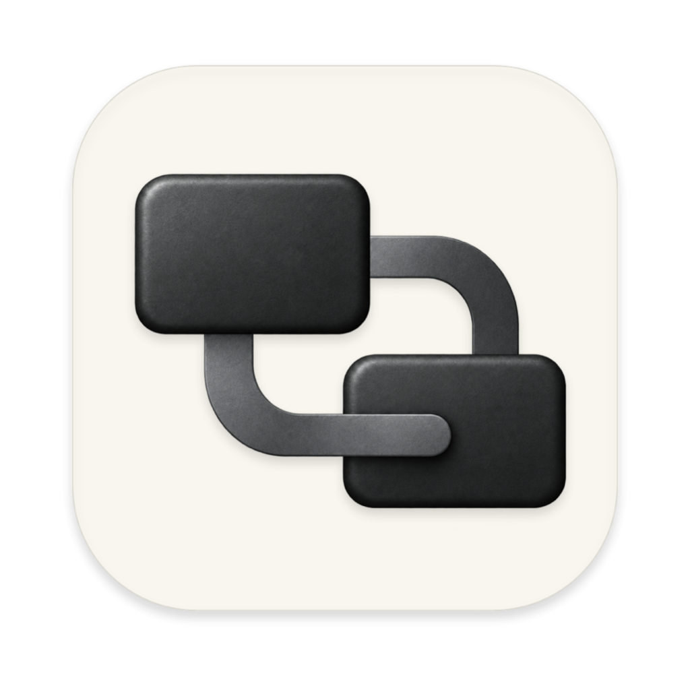
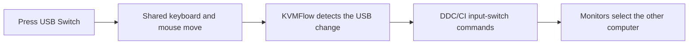

<div align="center">

<a href="https://kvmflow.net"></a>

# KVMFlow

### One button. Your keyboard, mouse, and monitors switch together.

**Press your USB sharing switch. KVMFlow switches the monitor inputs.**<br>
A local desktop app watches your shared USB devices and sends DDC/CI commands,<br>
so you can move between computers without separately reaching for each monitor’s menu.

[](https://github.com/Kerw1n1209/KVMFlow/releases) [](https://github.com/Kerw1n1209/KVMFlow/stargazers) [](LICENSE)<br>
 

**[Website](https://kvmflow.net)** &nbsp;·&nbsp; **[Releases](https://github.com/Kerw1n1209/KVMFlow/releases)** &nbsp;·&nbsp; **[Build guide](docs/building.md)** &nbsp;·&nbsp; **[Report an issue](https://github.com/Kerw1n1209/KVMFlow/issues)** &nbsp;·&nbsp; **English** · [简体中文](README.zh-CN.md)

<br>

<table>
<tr>
<td align="center" width="25%"><h3>1 button</h3>keyboard, mouse, and displays</td>
<td align="center" width="25%"><h3>Multiple monitors</h3>individual input mappings</td>
<td align="center" width="25%"><h3>Local</h3>USB detection and switching</td>
<td align="center" width="25%"><h3>中文 / English</h3>follow system or choose a language</td>
</tr>
</table>

</div>

## Is KVMFlow for you?

KVMFlow is for a desk where multiple computers share a keyboard, mouse, and one or more monitors. A USB sharing switch moves the USB devices; each computer also has its own video connection to the monitors. KVMFlow brings those two actions together.

- **Keep your existing USB switch.** Identify the shared device group during setup.
- **Record each monitor’s inputs.** Map the raw DDC/CI input values to the connected computers.
- **Work locally.** USB detection and input switching run on each computer. Automatic update checks use the update service.
- **Stay in control.** Run from the tray, launch at login, pause automatic switching, and export diagnostics.

You need monitors that support DDC/CI input switching. KVMFlow does not transmit keyboard or mouse input over the network.

## Quick start

**1 · Install on both computers.** See [kvmflow.net](https://kvmflow.net) for product information and [GitHub Releases](https://github.com/Kerw1n1209/KVMFlow/releases) for packages when available. Supported desktop platforms are macOS on Apple Silicon and Windows x64.

**2 · Connect the hardware.** Plug the shared keyboard and mouse into the USB sharing switch. Connect each computer’s video output to its own monitor input, then enable **DDC/CI** in the monitor’s on-screen menu.

**3 · Record your inputs.** Open KVMFlow on each computer. Use **Setup** to identify the USB switch, note this computer’s raw monitor input values, and enter the other computer’s values. Save the configuration.

**4 · Press USB Switch.** Check that both the USB devices and the actual monitor picture move to the intended computer.

Change the interface language under **Settings → Language**: follow the system, 简体中文, or English. The preference also applies to the tray, notifications, and native confirmation dialogs.

## How it works



The desktop client embeds the Rust runtime. Each monitor has its own input mapping, and the switch state machine handles timing, retries, and repeat protection. Simulated tests exercise the runtime without physical hardware.

## Hardware notes

| Factor | What to check |
| :-- | :-- |
| **DDC/CI support** | Monitors, adapters, docks, and video connections can affect control support. Enable DDC/CI in the monitor menu. |
| **Input codes** | Codes vary by manufacturer. Record the raw values for each monitor. |
| **Inactive inputs** | Some monitors only respond on their currently active input. KVMFlow tries to send the away command when USB devices leave. |
| **Windows timing** | Device-removal notifications can arrive after the physical button press. Latency depends on the system and drivers. |
| **Picture confirmation** | A successful DDC call means the command was sent. Confirm the actual picture yourself. |

If switching fails, recover the correct input with the monitor menu first, then check KVMFlow’s mappings and diagnostics. Remove device serial numbers, computer names, local paths, and other personal information before sharing diagnostic files.

## Development

Prepare Node.js LTS, Rust, and the target platform’s development tools. macOS needs Xcode Command Line Tools. Windows needs the MSVC Rust toolchain, Visual Studio C++ Build Tools, Windows SDK, and WebView2.

```sh
git clone https://github.com/Kerw1n1209/KVMFlow.git
cd KVMFlow
cargo test --locked --manifest-path sidecar/Cargo.toml --workspace
cd desktop
npm ci
npm test
npm run smoke
npm run test:rust
npm start
```

Local development and builds do not need the official update-signing private key. macOS builds prepare the DDC helper from the m1ddc source included in this repository. Linux can run the core, simulated sidecar, and frontend tests; it is not a supported native hardware client.

| Directory | Contents |
| :-- | :-- |
| `desktop/` | Tauri 2 client, local interface, tray, and build scripts |
| `sidecar/` | Rust switch state machine, USB/DDC adapters, and simulated tests |
| `probes/` | Hardware diagnostics, sanitized fixtures, and m1ddc source |
| `shared/` | Canonical branding assets |
| `docs/` | Local build and update documentation |

Interface text and language defaults live in [`messages.json`](desktop/src/renderer/i18n/messages.json). The renderer and native host share this catalog. See the [localization guide](desktop/src/renderer/i18n/README.md) for configuration and testing.

## Documentation and feedback

- [Build guide](docs/building.md): platform prerequisites and local builds without update signing.
- [Automatic updates](docs/auto-updates.md): update verification and release configuration.
- [Contributing](CONTRIBUTING.md): contribution scope, commit conventions, and checks.
- [Issues](https://github.com/Kerw1n1209/KVMFlow/issues): include your OS, monitor and connection details, reproduction steps, and sanitized diagnostics.

This repository contains the desktop software and its build dependencies. The official website, administration tools, cloud operations, and internal records are maintained separately.

## License

[MIT](LICENSE). Third-party code retains its original licenses and attribution; see [Third-party notices](THIRD_PARTY_NOTICES.md).
