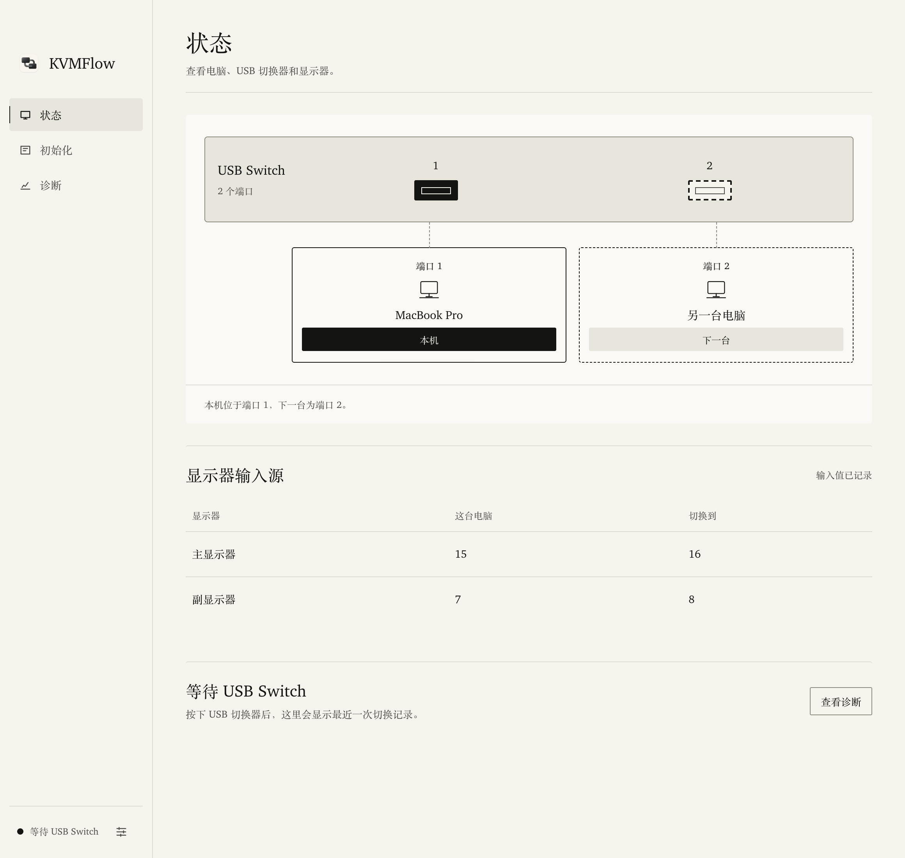
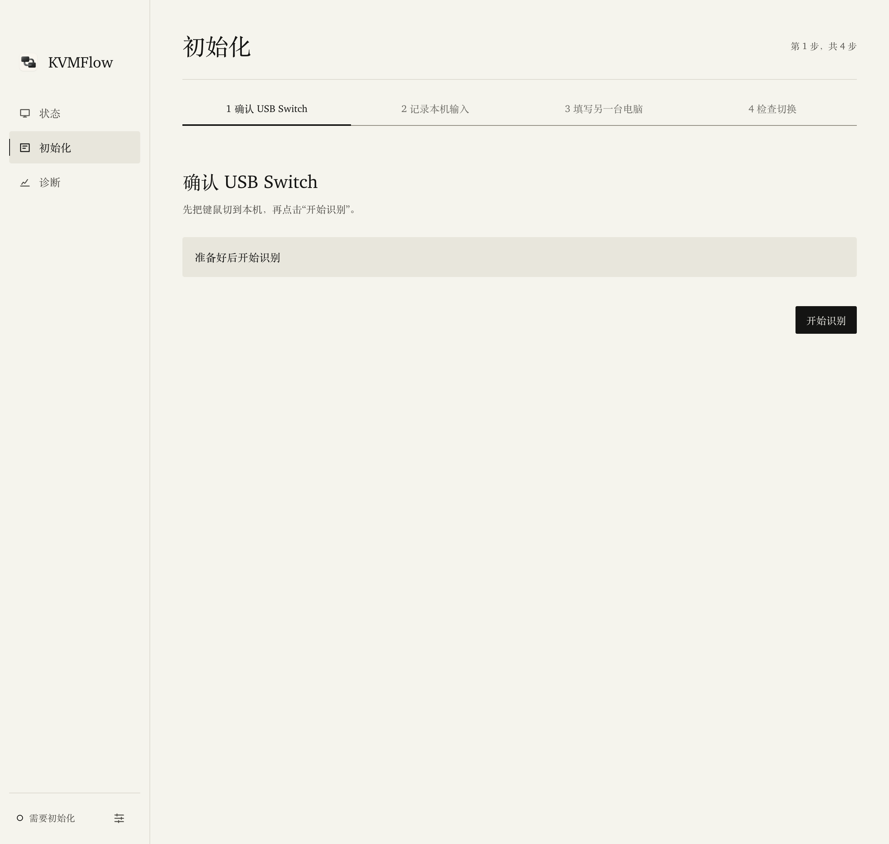
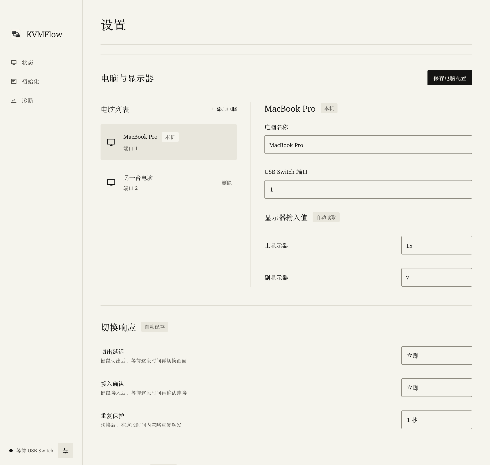
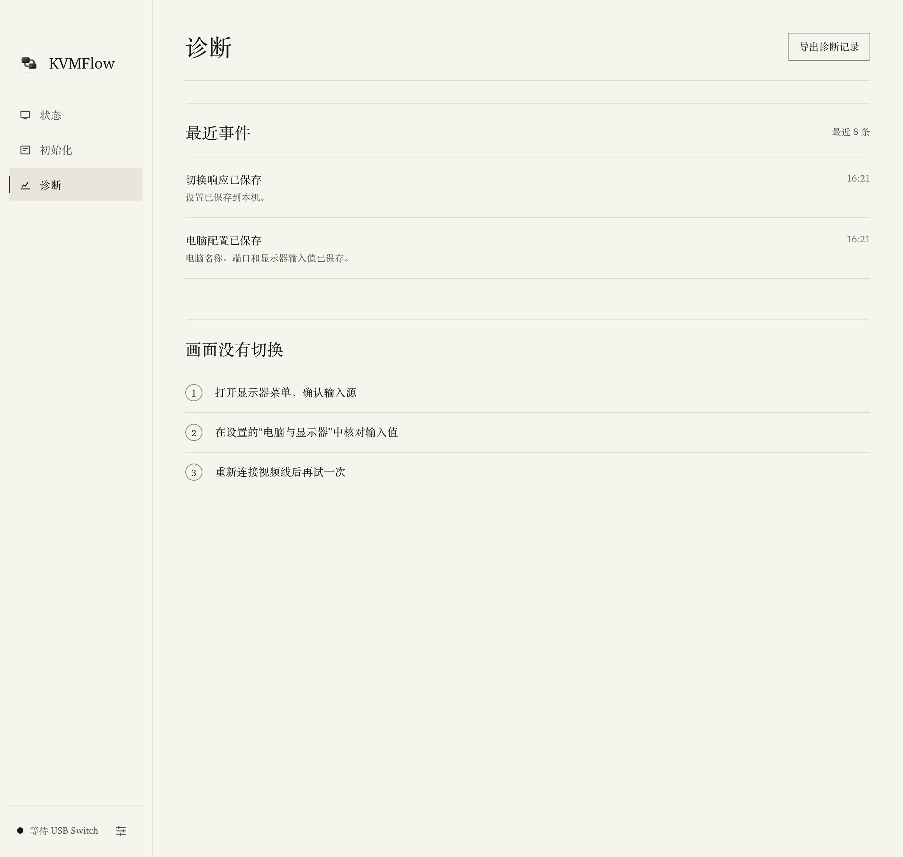
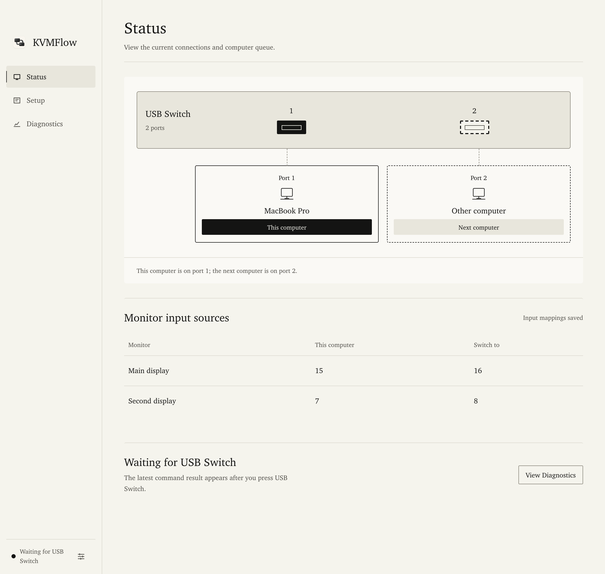
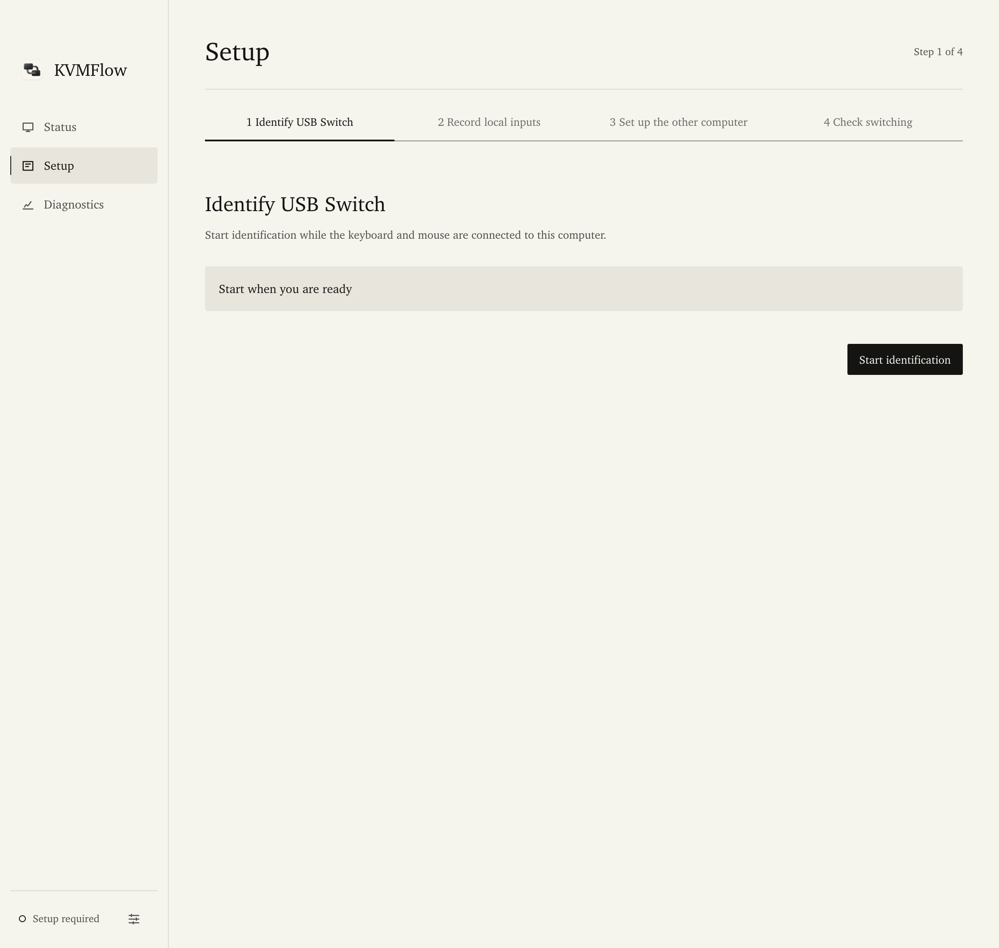
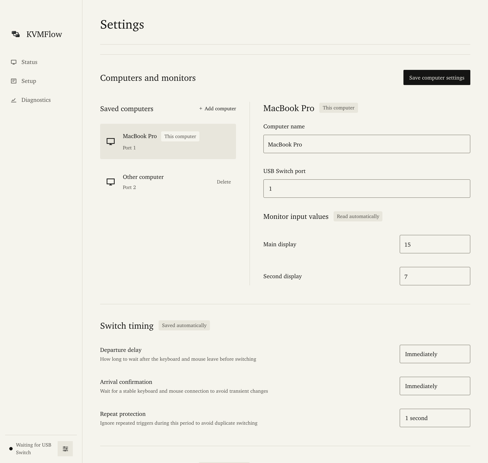
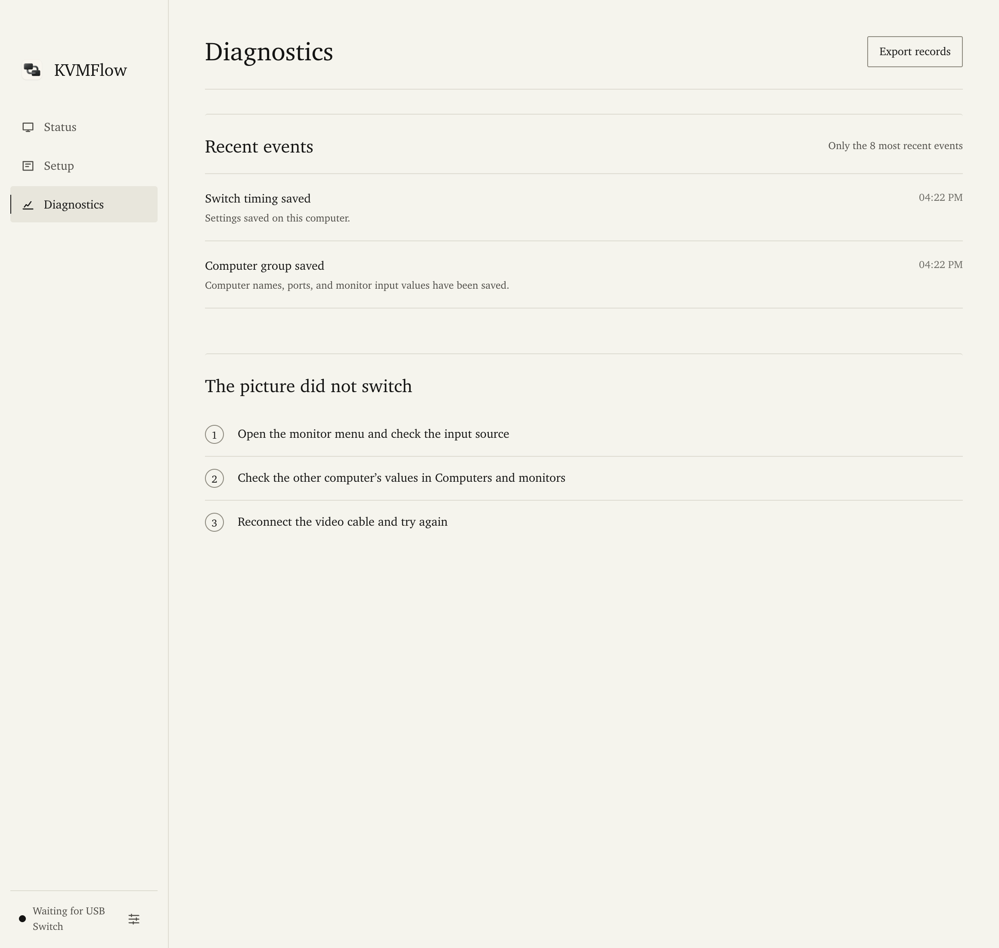

# KVMFlow v0.2.7 screenshots / 应用截图

Captured from the v0.2.7 renderer with example device data. These images show the interface, not verified USB/DDC hardware results. Input values are illustrative, not universal monitor presets.

截图来自 v0.2.7 的界面，使用示例设备数据，不代表 USB/DDC 硬件验证结果。显示器输入值仅作演示，不是通用预设。

## 简体中文

### 状态

### 初始化

### 设置

### 诊断

## English

### Status

### Setup

### Settings

### Diagnostics

